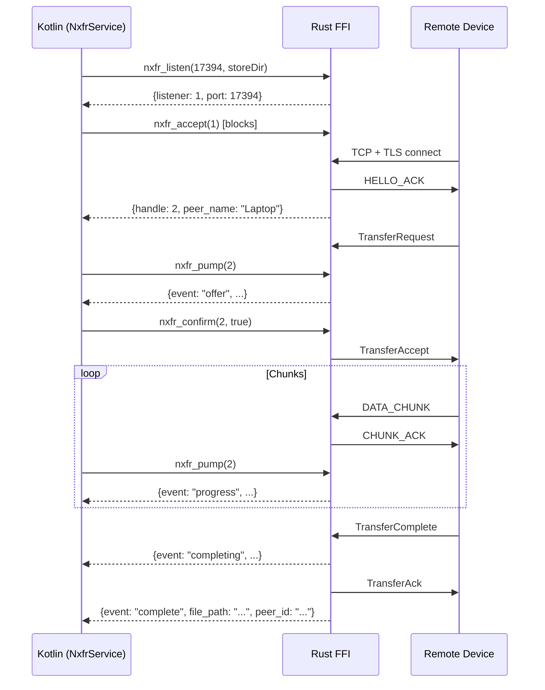

# Android Architecture

The Android client implementation uses FFI bindings to the Rust protocol core with a Jetpack Compose user interface.

## FFI Architecture

All protocol logic lives in Rust (`nxfr-ffi` crate). The Kotlin layer is a wrapper that calls C-ABI exports via JNI. **No CBOR, no frame parsing, and no TLS config in Kotlin.**

```
┌─────────────────────────────────────────────┐
│  Kotlin / Jetpack Compose UI               │
│  ┌───────────────────────────────────────┐  │
│  │  NxfrService  (foreground, dataSync)  │  │
│  │  ├─ listen + accept loop (IO)         │  │
│  │  ├─ pump coroutine → StateFlow        │  │
│  │  └─ send flow (connect → send_file)   │  │
│  └───────────────────────────────────────┘  │
│                    ↕ JNI                     │
│  ┌───────────────────────────────────────┐  │
│  │  libnxfr_ffi.so  (Rust, cdylib)       │  │
│  │  ├─ OnceLock<Runtime> (tokio, 2 wkrs) │  │
│  │  ├─ SESSIONS: Mutex<HashMap<u64, ..>> │  │
│  │  ├─ LISTENERS: Mutex<HashMap<u64,..>> │  │
│  │  ├─ TLS 1.3 via tokio-rustls          │  │
│  │  ├─ NxfrConnection framing + codec    │  │
│  │  └─ SHA-256 per-chunk verification    │  │
│  └───────────────────────────────────────┘  │
└─────────────────────────────────────────────┘
```

## FFI Exports

| Function | Purpose |
|----------|---------|
| `nxfr_identity_generate(store_dir)` | Generate keypair and self-signed certificate |
| `nxfr_identity_load(store_dir)` | Load existing identity |
| `nxfr_connect(addr, store_dir)` | TLS 1.3 client connect + HELLO exchange |
| `nxfr_listen(port, store_dir)` | Bind TLS listener, spawn accept loop |
| `nxfr_accept(listener)` | Pop pending connection, do HELLO exchange |
| `nxfr_send_file(handle, path)` | Spawn sender task (non-blocking) |
| `nxfr_pump(handle)` | Non-blocking event poll (JSON) |
| `nxfr_confirm(handle, accepted)` | Accept/reject incoming transfer offer |
| `nxfr_close(handle)` | Send SessionClose, release resources |
| `nxfr_pair_begin(handle)` | Send PairRequest, derive SAS code |
| `nxfr_pair_confirm(handle, accepted)` | Confirm/reject pairing |
| `nxfr_derive_sas(device_id_a, device_id_b, exporter_bytes, exporter_len)` | Derive 6-digit SAS code from TLS exporter bytes |
| `nxfr_web_start(port, store_dir, pin)` | Start token/PIN-gated browser upload portal |
| `nxfr_web_share_start(port, store_dir, pin, manifest)` | Start token/PIN-gated browser share server |
| `nxfr_web_status()` | Query running status and active in-flight stream count |
| `nxfr_web_stop()` | Gracefully stop active web server |
| `nxfr_web_fingerprint(store_dir)` | Compute SPKI SHA-256 fingerprint for web cert pinning |
| `nxfr_web_respond_request(handle, response)` | Respond to a pending web upload/download request |
| `nxfr_history_add(record, store_dir)` | Append record to persistent transfer history |
| `nxfr_history_list(limit, store_dir)` | Retrieve ordered transfer history records |
| `nxfr_history_clear(store_dir)` | Clear transfer history records |

## Event Flow



## Build Requirements

- Rust targets: `aarch64-linux-android`, `x86_64-linux-android`
- NDK r26+ (tested with r27c)
- `cargo-ndk` for cross-compilation
- JDK 17 (via Android Studio JBR)
- AGP 8.7 + Kotlin 2.0 + Jetpack Compose

## Discovery (4-Tier Ladder)

The Android client uses a multi-tier discovery strategy for local networks and hotspots. All discovery runs off the main thread via `Dispatchers.IO`.

| Tier | Mechanism | Implementation | Latency | Hotspot-Safe |
|------|-----------|----------------|---------|--------------|
| 0 | **UDP Beacon** | `UdpBeacon.kt` — state-aware adaptive broadcast on port 17395 (1s active / 5s background / 30s low power) | ~1 s | Yes |
| 1 | **NSD (mDNS/DNS-SD)** | `NsdDiscovery.kt` — `android.net.nsd.NsdManager` | 2–5 s | No |
| 2 | **TCP Subnet Probe** | `HotspotAwareDiscovery.kt` — scan /24 on port 17394 | 5–30 s | Yes |
| 3 | **Manual Connect** | UI-driven IP:port → `nxfr_connect()` | User-initiated | Yes |

`HotspotAwareDiscovery.kt` orchestrates all tiers, merging results into a single `StateFlow<List<DeviceUiModel>>` with deduplication by `advertised_id` (beacon) or `device_id` (NSD/probe).

### Privacy: Beacon advertised_id

The UDP beacon does not broadcast the persistent `device_id`. Beacons use a daily-rotating `advertised_id` derived via `HKDF-SHA256(device_id || YYYY-MM-DD)`.

On `UdpBeacon.start()`, the Kotlin layer calls `NxfrBridge.nxfr_advertised_id(deviceIdHex, LocalDate.now().toString())` to compute the rotating ID. The beacon payload is:

```json
{"v":1,"advertised_id":"a1b2c3d4e5f67890","name":"My Phone","plat":"android","tcp_port":17394}
```

The real `device_id` is only revealed after the TLS 1.3 handshake, inside the encrypted HELLO message. This prevents passive Wi-Fi observers from tracking devices across networks.
