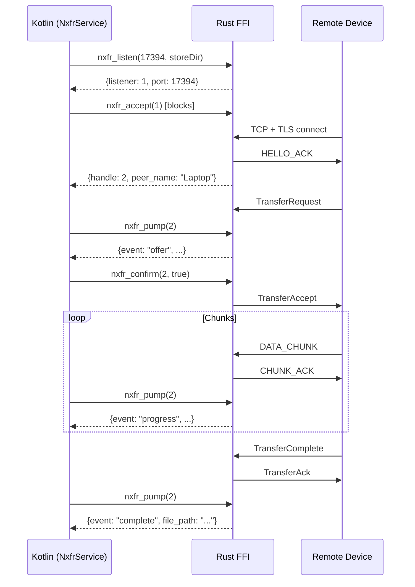

# Android Architecture

!!! info "Alpha Implementation"
    The Android client is in **alpha** stage (Phase 7). FFI-based file transfers
    work; UI is placeholder; no resume journal; auto-accept for incoming offers.

## FFI Architecture

All protocol logic lives in Rust (`nxfr-ffi` crate). The Kotlin layer is a thin
wrapper that calls C-ABI exports via JNI. **No CBOR, no frame parsing, no TLS
config in Kotlin.**

```
┌─────────────────────────────────────────────┐
│  Kotlin / Jetpack Compose UI               │
│  ┌───────────────────────────────────────┐  │
│  │  NxfrService  (foreground, dataSync)  │  │
│  │  ├─ listen + accept loop (IO)         │  │
│  │  ├─ pump coroutine → StateFlow        │  │
│  │  └─ send flow (connect → send_file)   │  │
│  └───────────────────────────────────────┘  │
│                    ↕ JNI                     │
│  ┌───────────────────────────────────────┐  │
│  │  libnxfr_ffi.so  (Rust, cdylib)       │  │
│  │  ├─ OnceLock<Runtime> (tokio, 2 wkrs) │  │
│  │  ├─ SESSIONS: Mutex<HashMap<u64, ..>> │  │
│  │  ├─ LISTENERS: Mutex<HashMap<u64,..>> │  │
│  │  ├─ TLS 1.3 via tokio-rustls          │  │
│  │  ├─ NxfrConnection framing + codec    │  │
│  │  └─ SHA-256 per-chunk verification    │  │
│  └───────────────────────────────────────┘  │
└─────────────────────────────────────────────┘
```

## FFI Exports (Phase 7)

| Function | Purpose |
|----------|---------|
| `nxfr_identity_generate(store_dir)` | Generate P-256 keypair + self-signed cert |
| `nxfr_identity_load(store_dir)` | Load existing identity |
| `nxfr_connect(addr, store_dir)` | TLS 1.3 client connect + HELLO exchange |
| `nxfr_listen(port, store_dir)` | Bind TLS listener, spawn accept loop |
| `nxfr_accept(listener)` | Pop pending connection, do HELLO exchange |
| `nxfr_send_file(handle, path)` | Spawn sender task (non-blocking) |
| `nxfr_pump(handle)` | Non-blocking event poll (JSON) |
| `nxfr_confirm(handle, accepted)` | Accept/reject incoming transfer offer |
| `nxfr_close(handle)` | Send SessionClose, release resources |
| `nxfr_pair_begin(handle)` | Send PairRequest, derive SAS code |
| `nxfr_pair_confirm(handle, accepted)` | Confirm/reject pairing |

## Event Flow



## Build Requirements

- Rust targets: `aarch64-linux-android`, `x86_64-linux-android`
- NDK r26+ (tested with r27c)
- `cargo-ndk` for cross-compilation
- JDK 17 (via Android Studio JBR)
- AGP 8.7 + Kotlin 2.0 + Jetpack Compose

## Current Limitations (Phase 7)

- **No resume journal** — interrupted transfers restart from zero.
- **Auto-accept** — incoming offers are accepted immediately (no consent UI).
- **No mDNS discovery** — devices must connect by IP:port.
- **Single session** — one active transfer at a time.
- **No Android Keystore** — identity stored in app private files.
