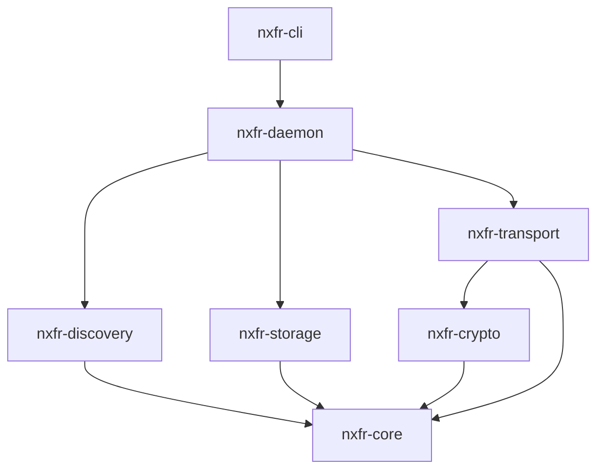

# Linux Architecture

The Linux architecture for NXFR is built around a robust, headless background daemon (`nxfr-daemon`), which manages the core networking and protocol services. Separate CLI (`nxfr-cli`) and GUI clients interact with this daemon via IPC, ensuring a clean separation of concerns.

## Daemon Architecture

The `nxfr-daemon` is designed as a systemd user service (`systemd --user`). It utilizes the highly efficient asynchronous `tokio` runtime, operating on a single-threaded event loop for control logic with a multithreaded pool reserved for heavy file I/O and cryptographic hashing (like SHA-256 or BLAKE3).

This daemon design means the network layer, discovery layer, and state management continue running even if the client interface (like the CLI or a GUI) is closed.

## Crate Dependency Graph

The project is split into several modular crates to maintain strict boundaries. Here is the dependency graph showing how the components interact:

- **nxfr-core:** Contains the pure state machines, CBOR serialization, and protocol logic. It performs no I/O.
- **nxfr-transport:** Manages TLS 1.3 (via `rustls`) and asynchronous TCP socket operations.
- **nxfr-discovery:** Handles mDNS using Avahi D-Bus bindings or native Rust implementations.
- **nxfr-crypto:** Handles ECDSA P-256 keys, certificate generation, and HKDF for SAS pairing.
- **nxfr-storage:** Manages SQLite databases for paired devices and the transfer resume journal.

## Inter-Process Communication (IPC) Protocol

Clients communicate with the daemon using a simple IPC protocol consisting of line-delimited JSON over a Unix domain socket.

This JSON-RPC style interface allows multiple clients (such as the `nxfr-cli` and a future GTK GUI) to control the daemon simultaneously, query transfer status, and receive real-time events.

## State Management

Internal daemon state is managed through a central `DaemonState` struct. To ensure thread safety across Tokio tasks without blocking the event loop, state mutations heavily rely on `Mutex` and `RwLock` patterns from the `tokio::sync` module.

## File Locations

The Linux daemon relies on standard XDG Base Directory specifications to store files. Please refer to the [File Locations table in the Installation guide](../getting-started/installation.md#file-locations) for the complete list of paths.

## Single-Instance Guard

To prevent port conflicts and database corruption, `nxfr-daemon` implements a strict single-instance guard. It achieves this by acquiring an exclusive lock on its Unix socket (`~/.local/state/nxfr/nxfr.sock`). If another daemon tries to start, it detects the lock and immediately exits with an error.
