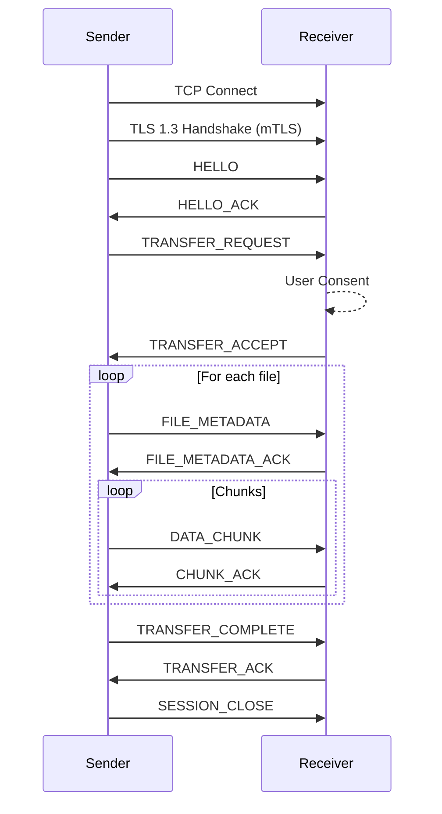

!!! warning "Draft Specification"
    This is the v0.1 draft specification. The protocol is actively evolving.
    Refer to the [`docs/`](https://github.com/nxfr/nxfr/tree/main/docs) directory for the raw normative text.

# Protocol Overview

The Nearby Xfer Protocol (NXFR) is an open, platform-neutral protocol for secure file transfer between trusted nearby devices on a Local Area Network (LAN). NXFR provides zero-configuration discovery, mutual authentication, explicit user consent, resumable transfers, and directory streaming — all without cloud services, user accounts, or cables.

NXFR operates as a session-oriented binary protocol over TCP with TLS 1.3. Devices discover each other via mDNS/DNS-SD, authenticate using long-term ECDSA P-256 identity keys with Trust On First Use (TOFU) pairing, and exchange files through a multiplexed framing layer carrying CBOR-encoded control messages and raw binary data chunks.

## Terminology

| Term | Definition |
|------|-----------|
| **Device** | A host running an NXFR implementation. |
| **Initiator** | The device that opens the TCP connection. |
| **Responder** | The device that accepts the TCP connection. |
| **Sender** | The device transmitting file data in a transfer. |
| **Receiver** | The device accepting file data in a transfer. |
| **Session** | A TLS-secured connection between two devices after HELLO exchange. |
| **Transfer** | A logical unit of work: one or more files sent from sender to receiver. |
| **Stream** | A per-file data channel within a transfer, identified by `stream_id`. |
| **Paired** | A state where two devices have mutually verified identity via SAS. |
| **TOFU** | Trust On First Use — accept identity on first connection, pin for future. |
| **SAS** | Short Authentication String — a human-verifiable code for pairing. |
| **device_id** | SHA-256 hash of a device's SubjectPublicKeyInfo (SPKI) DER encoding. |
| **Frame** | The atomic unit of NXFR wire communication: a 28-byte header + payload. |

## Goals & Non-Goals

### Goals
1. **Fast LAN transfer.** Saturate gigabit Ethernet and modern Wi-Fi links for bulk file transfer.
2. **Strong security.** Mutual authentication, encrypted transport, integrity verification.
3. **Privacy by default.** No discovery leakage when not actively receiving. No cloud telemetry.
4. **Cross-platform.** Implementable on Linux, Android, Windows, macOS, and iOS using standard libraries.
5. **User consent.** Every transfer requires explicit approval by default.
6. **Resumable transfers.** Survive network interruptions without re-sending completed work.
7. **Directory support.** Transfer directory trees preserving structure.
8. **Simple pairing.** TOFU with visual SAS verification — no passwords, no accounts.

### Non-Goals
1. **Internet/WAN transfer.** NXFR is LAN-only. No relay servers, no NAT traversal.
2. **File synchronization.** NXFR is point-in-time transfer, not continuous sync.
3. **Remote control.** No shell access, clipboard sharing, notification mirroring, or input forwarding.
4. **Streaming media.** Not a media streaming protocol.
5. **Always-on daemon.** The protocol does not require or assume a persistent background service.

## Architecture Overview

NXFR is organized in five layers:

```text
┌─────────────────────────────────────────┐
│          Application / UI Layer         │   User interaction, consent, file picking
├─────────────────────────────────────────┤
│          Transfer Layer (§11-14)        │   Transfer state machine, resume, directory
├─────────────────────────────────────────┤
│          Session Layer (§9-10)          │   HELLO, pairing, message dispatch
├─────────────────────────────────────────┤
│          Framing Layer (§7-8)           │   Frame parsing, CBOR encoding, chunking
├─────────────────────────────────────────┤
│          Transport Layer (§6)           │   TCP + TLS 1.3
├─────────────────────────────────────────┤
│          Discovery Layer (§5)           │   mDNS/DNS-SD
└─────────────────────────────────────────┘
```

The initiator is the device that opens the TCP connection. The initiator MAY be either the sender or the receiver — the protocol is symmetric after HELLO exchange. In the common case, the sender initiates.

## Session Lifecycle



Refer to the [normative protocol spec](https://github.com/nxfr/nxfr/tree/main/docs/PROTOCOL.md) for full details.
