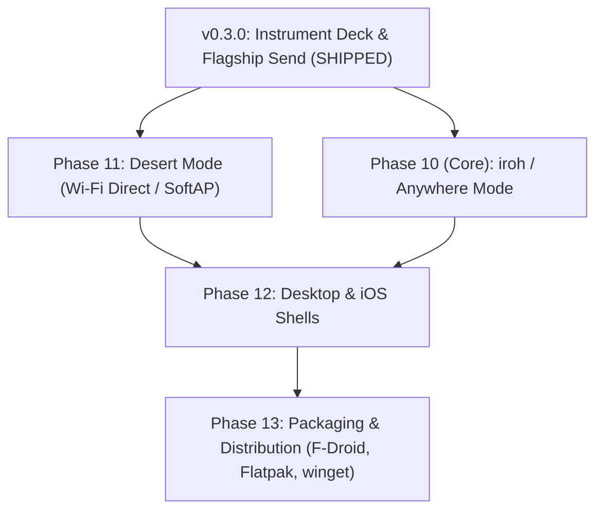

# Implementation Plan — NXFR Protocol (v0.3.0)

Master engineering implementation roadmap tracking completed architectural milestones and upcoming protocol phases.

---

## 🏁 Completed Milestones (Phases 9.7 – 10-ID)

### Phase 9.7–9.9: Stability & Storage Architecture
- [x] **Interactive Consent Flow**: Native JNI bridge to `NxfrState.Offering` with 120s automatic offer timeout ([`#9.7a`](https://github.com/nxfr/nxfr/commit/51273b3), [`#9.7c`](https://github.com/nxfr/nxfr/commit/a339976)).
- [x] **Path-Jail Sanitization**: Canonical path boundary enforcement preventing directory traversal attacks.
- [x] **3-Tier Storage Engine**: MediaStore automated indexing, SAF directory tree writing, and sandbox fallback ([`#9.9b`](https://github.com/nxfr/nxfr/commit/02765cd), [`#9.9c`](https://github.com/nxfr/nxfr/commit/6bbcca2)).
- [x] **EROFS Filesystem Handling**: Sandboxed cache staging for read-only system images.

### Phase 9.10–9.12: Hardening, JNI Guards & Freshness Gates
- [x] **Honest Visibility Toggle**: Dropping listener sockets, unbinding ports with `SO_REUSEADDR` ([`#9.11b`](https://github.com/nxfr/nxfr/commit/3113a05)).
- [x] **JNI Panic Boundary**: Crash-guarded bridge methods preventing native aborts from crashing the JVM ([`#9.11a`](https://github.com/nxfr/nxfr/commit/6eeff05)).
- [x] **Gradle Native Freshness Gate**: Automated `:app:verifyNativeFresh` and `:app:verifyNativeSymbols` tasks ([`#9.12a`](https://github.com/nxfr/nxfr/commit/5611745)).
- [x] **Global Identity Unification**: Persistent identity keys shared across mTLS and browser endpoints ([`#9.12c`](https://github.com/nxfr/nxfr/commit/be569e9)).

### Phase 9.13–9.16: UX, Trust Store & Lifecycle
- [x] **Diagnostic Logging**: Native logcat piping via `android_logger` ([`#9.13`](https://github.com/nxfr/nxfr/commit/6445ae4)).
- [x] **Transfer History SQLite Database**: Local session recording with direction tags (`TX`/`RX`) and clear actions ([`#9.14a`](https://github.com/nxfr/nxfr/commit/d1fa985)).
- [x] **Foreground Service Keep-Alive**: `dataSync` foreground service binding ([`#9.14b`](https://github.com/nxfr/nxfr/commit/f605283)).
- [x] **Completion Action Sheet**: Post-transfer sheet with Intent opener and SHA-256 hash copy ([`#9.15`](https://github.com/nxfr/nxfr/commit/e96d855)).

### Phase 9.17–9.19: Scanners & Polish
- [x] **Fragment-Only Web Tokens**: URL fragment hashes (`/#t=<token>`) preventing token leakage to server logs ([`#9.17`](https://github.com/nxfr/nxfr/commit/fe917bd)).
- [x] **Animations Contract**: Respecting `LocalAnimationsEnabled` and system `ANIMATOR_DURATION_SCALE` ([`#9.18`](https://github.com/nxfr/nxfr/commit/b065c71)).
- [x] **Network Validation**: Strict range checking on ports (1024–65535), timeouts, and multicast addresses.
- [x] **QR Camera Scanner**: Send-tab camera scanner with ticket parsing ([`#9.19`](https://github.com/nxfr/nxfr/commit/57ee5ef)).

### Phase 9.20–9.23: Flagship Send & Notifications
- [x] **Zero-Permission Staging Matrix**: 7-way attach rail (Files, Media, Folders, Contacts vCard without `READ_CONTACTS`, Apps, Text, Paste) ([`#9.20a`](https://github.com/nxfr/nxfr/commit/9ac5a8c), [`#9.20b`](https://github.com/nxfr/nxfr/commit/d2d74f3)).
- [x] **Send Modes**: Single recipient auto-clear, Multiple recipient queue, Share via Link web server ([`#9.21a`](https://github.com/nxfr/nxfr/commit/2ac7b5e), [`#9.21b`](https://github.com/nxfr/nxfr/commit/f55adce), [`#9.21c`](https://github.com/nxfr/nxfr/commit/a5887ea)).
- [x] **Live Transfer Notifications**: Throttled ($\le 4\text{ Hz}$) foreground notification channel with progress bar ([`#9.23`](https://github.com/nxfr/nxfr/commit/450952b)).

### Phase 10-ID: Instrument Deck Identity Overhaul
- [x] **P0 — Token Engine & Architecture**: `DeckColors` data class (`DarkDeckColors`, `LightDeckColors`, `OledDeckColors`), signal-only cyan rule, typography roles ([`#10-id-a`](https://github.com/nxfr/nxfr/commit/b749761)).
- [x] **P1 — The Home Deck**: `TelemetryRibbon`, `IdentityDeckBar`, `BeamVisualizer`, industrial `BreakerSwitch`, `ActionRail`, and `RecentSessionsCard` ([`#10-id-b`](https://github.com/nxfr/nxfr/commit/515096e)).
- [x] **P2 — Send Compose & Transfer Console**: `AttachChipRail`, `StagedFilmstrip`, `DeviceDeckCard`, `PacketStreamVisualizer`, and `TerminalStatsBlock` ([`#10-id-c`](https://github.com/nxfr/nxfr/commit/e15422c)).
- [x] **P3 — Consent Verification & Settings Ledger**: Cryptographic consent modal manifest, SAS auth digits, and structured settings ledger with stamp seals ([`#10-id-d`](https://github.com/nxfr/nxfr/commit/84dfcbb)).

---

## 🚀 Next Milestones (Roadmap to v1.0)

### 🏜️ Phase 11: Desert Mode (Off-Grid Wi-Fi Direct & SoftAP)
- **Goal**: Enable sovereign file transfer in the field with zero local Wi-Fi router or infrastructure.
- **Components**:
  - **Android Wi-Fi P2P (`WifiP2pManager`)**: Automated group negotiation (Group Owner / Client).
  - **Autonomous SoftAP Hotspot**: Temporary local hotspot broadcasting SSID `NXFR-<short_id>` with QR code ticket.
  - **Hotspot-Aware Socket Rebind**: Automatic daemon listener migration to the `192.168.49.1` or `192.168.43.1` interface upon hotspot ignition.

### 🌐 Phase 10 (Core): iroh / Anywhere Mode (Wide-Area QUIC Hole-Punching)
- **Goal**: Peer-to-peer transfers across the internet without port forwarding, central accounts, or third-party cloud storage.
- **Components**:
  - **iroh-net Integration**: QUIC transport with DERP (Designated Encrypted Relay for Packets) fallback.
  - **Direct Hole-Punching**: STUN/UPnP NAT traversal establishing direct UDP pipes.
  - **Global Node Ticket**: Compact base32 connection string embedding the receiver's public key and relay node hint.

### 💻 Phase 12: Desktop & iOS Shells
- **Goal**: Bring the Instrument Deck visual identity to Linux, macOS, Windows, and iOS.
- **Components**:
  - **Linux (GTK4 / Libadwaita / Rust)**: Native desktop client integrating with FreeDesktop notifications and file managers.
  - **Windows (WinUI 3 / Rust)**: Windows desktop shell with shell extension "Send to NXFR".
  - **iOS (SwiftUI / Rust via UniFFI)**: Native iOS client using MultipeerConnectivity & AirDrop-adjacent intent extensions.

### 📦 Phase 13: Packaging & Distribution
- **Goal**: Frictionless, trust-verified distribution channels.
- **Components**:
  - **Android**: F-Droid reproducible build recipe and Google Play Store release.
  - **Linux**: Flathub Flatpak, Snapcraft, AUR (`nxfr-git`), and Debian `.deb` packages.
  - **Windows & macOS**: `winget install nxfr`, `brew install nxfr`.
